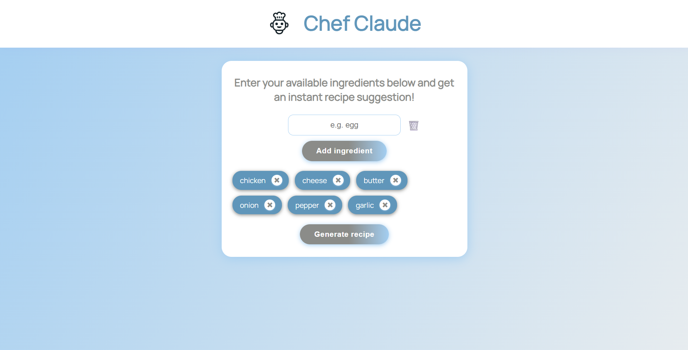
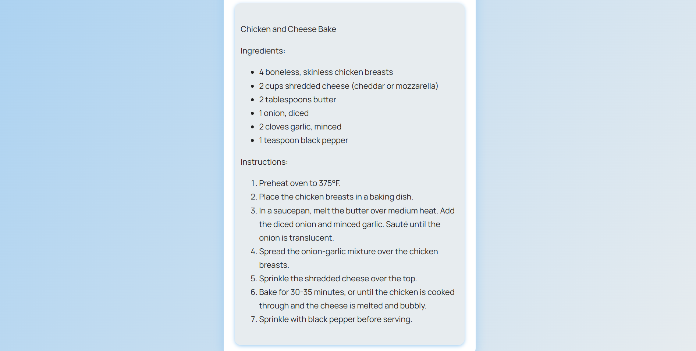

# Chef Claude

A modern, minimalistic React web app that helps you generate creative recipes from any list of ingredients.  
Type your ingredients, get instant suggestions, and let the “chef AI” inspire your next meal.

> **This project goes beyond just frontend! It integrates with the powerful Anthropic AI API (Claude) for real recipe generation, using secure serverless functions via Netlify.**

---

## Demo

[Live Demo](https://chefclaudermc.netlify.app/) 

---

## Screenshots

  


---

## Features

- **Super fast & modern UI:** Built with React + Vite + Tailwind CSS.
- **Instant suggestions:** Get dropdown ingredient suggestions as you type.
- **AI Recipe Generator (Anthropic API):** Generates creative recipes powered by Anthropic Claude API, not just random logic!
- **Secure serverless backend:** Uses Netlify Functions to keep your API key safe and avoid CORS headaches.
- **Responsive & mobile-ready:** Looks great on any device.
- **Accessible:** Large fonts, color contrast, keyboard navigation support.
- **Fun details:** Animated loader, subtle button effects, clean card design.
- **Easy reset:** Remove single ingredients or clear all with a single click.

---

## How it works (API & Serverless integration)

- When you click “Generate Recipe”, the app sends your ingredient list to a custom Netlify serverless function.
- This function (in `/netlify/functions/`) acts as a secure proxy: it takes your ingredients, calls the Anthropic Claude API (using your secret API key, never exposed to the browser!), and returns the AI-generated recipe.
- The frontend receives the recipe and displays it instantly.  
  No API keys or secrets are ever leaked to the client!

---

## Tech Stack

- **React** (with hooks)
- **Vite** (for instant dev & build)
- **Tailwind CSS** (custom + utility classes)
- **Anthropic Claude API** (real AI-powered recipe suggestions)
- **Netlify Functions** (serverless backend, secure proxy for API)
- **ESLint** (clean code)
- **Netlify-ready** (just connect repo and deploy)
- **No traditional backend needed** (all serverless)

---

## Project Structure

```
/src
  App.jsx          # Main logic & state
  Header.jsx       # Header bar & logo
  ai.js            # Logic for calling serverless function (API integration)
  components/      # UI components (IngredientCard, SuggestionBox etc)
  images/          # Logo and assets
  index.css        # All custom CSS (responsive, animations)
  main.jsx         # React entry point
/netlify/functions/generateRecipe.js  # Netlify serverless function (calls Anthropic API)
/netlify.toml     # Netlify config for functions/deploy
```

---

##  Getting Started (Local & Deploy)

#### 1. Local development (UI + mock)
- You can run the UI locally, but for full AI-powered experience you need to deploy on Netlify with your own API key.

#### 2. Deploy on Netlify (get full functionality!)
1. **Fork/clone this repo**
2. **Create a free Netlify account** at [netlify.com](https://netlify.com)
3. **Connect your repo** and deploy (Netlify will detect `/netlify/functions/` automatically)
4. In the Netlify dashboard, go to Site settings → Environment variables and add:
    - `ANTHROPIC_API_KEY=<your-anthropic-api-key>`
5. That’s it! The serverless function will securely call the API and the UI will “just work”.

---

## Requirements

- **Node.js** (v18.x or v20.x)
- **VS Code** (recommended)
- VS Code extensions:
    - ES7+ React/Redux snippets
    - Tailwind CSS IntelliSense
    - Prettier

---

## Author

Cosmin M. Rotaru  
[GitHub](https://github.com/CosminMRotaru)  
[LinkedIn](https://www.linkedin.com/in/marius-cosmin-rotaru-a8a242262/)

---

## License

MIT
